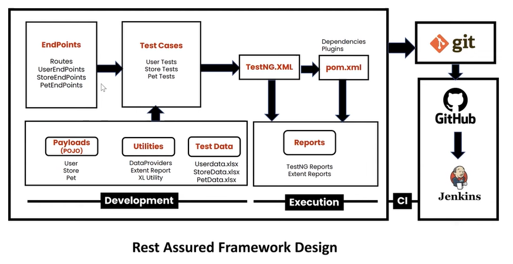
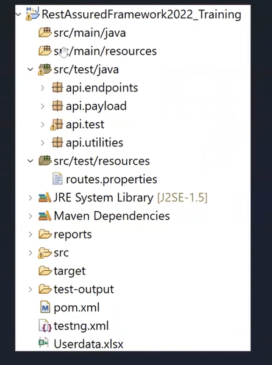

Objectives
----------
1. Re-usability
2. Maintainability
3. Readability


Hybrid Driven

Phases
-----------
1. Understanding requirement
- Functional Specifications (static)
- Swagger

2. Choose automation tool - Rest Assured library

3. Design 
4. Development
5. Execution + CI



------------------
pre-requisites


step: 1  Create Maven project

step: 2  Update POM.xml with required dependencies.

step: 3  Folder structure



step: 4  Create Routes.java --> contains URL's

Step: 5  Create UserEndPoint.java --> contains CRUD method implementation

step: 6 Create testcases 

step: 7 Create data driven test

-----------

## Common commands to Run the project in CI pipeline
```
maven phases
1. clean
2. validate
3. compile
4. test 
5. package
6. install
7. deploy
```

```
1. running the tests
   mvn test
   This command runs all the unit tests in the project.
   It is the most basic command to ensure that your code passes all the tests.
```
```
2. running the tests using groups eg smoke, regression
   mvn test -Dfile="testng.xml"

   This command runs all the unit tests in the project.
   It is the most basic command to ensure that your code passes all the tests.
```
